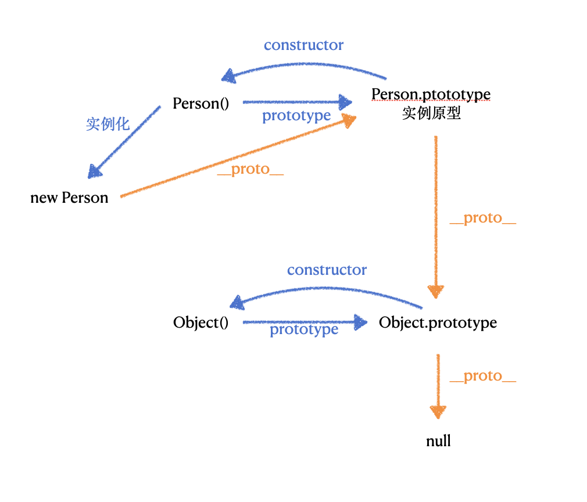

### for in 和 for of 区别
for of 遍历的是原生的迭代器Symbol.iterator属性，没有这个属性是不能用for of遍历的
for in 可以遍历可枚举属性，包含原型链上的，所以性能会比较差
[here](./forIn%26forOf.js)

### 原型链


#### 注意点:
1. __proto__
它来自于Object.prototype，与其说是一个属性，不如说是一个getter/setter，当使用obj.__proto__去访问原型的时候，可以理解成Object.getPrototypeOf(obj);

2. 真的是继承吗
我们总是说`每一个对象都会从原型“继承”属性`，实际上，继承是一个十分迷惑性的说法，引用《你不知道的JavaScript》中的话：
```text
继承意味着复制操作，然而JavaScript默认并不会复制对象的属性，相反，JavaScript只是在两个对象之间创建了一个关联，这样，一个对象就可以通过委托的方式访问另一个对象上的属性和方法。所以，与其叫继承，委托的说法更准确些。
```

3. 如何解释 Function.__proto__ === Function.prototype
首先，Function是JS的内置对象，在运行前就已经存在的东西，所以就没有什么鸡生蛋，蛋生鸡，我自己生我自己的问题。
至于为什么会有这个等式，可能有两个原因：
第一：
与其他函数、对象保持一致
第二：
只是表明一种关系

### 作用域 - 词法作用域
是指在程序中定义变量的区域，通俗理解就是，作用域控制着变量和函数的可见性和生命周期
在 js 中 作用域 又称 词法作用域
词法作用域就是指作用域是由代码中函数声明的位置来决定的，所以词法作用域是静态的作用域，通过它就能够预测代码在执行过程中如何查找标识符。


### 执行上下文栈
又称为调用栈

### 箭头函数 this 指向哪里
箭头函数不会创建自己的执行上下文，所以没有属于自己的this，它内部的this是继承于外部的执行上下文中的this，而且不会改变。
借助Babel理解一下箭头函数：
```js
// ES6
const obj = {
    getArrow() {
        return () => {
            console.log(this === obj);
        }
    }
}
```
=> 通过Babel转译后
```js
// ES5
var obj = {
    getArrow: function getArrow() {
        var _this = this;
        return function() {
            console.log(_this === obj);
        }
    }
}
```

### 为什么不建议频繁的增删对象的属性
隐藏类
慢属性 - 字典类型的属性

### 内存泄漏
1. 不合理的使用闭包
    - 获取过多的变量
    ```js
    function fn() {
        var bigObj = {
            name: 'youstde',
            age: 18,
            sex: 'boy',
            //...
        }
        return function inner() {
            return bigObj.name;
        }
    }
    ```
    上面例子其实我只用到了 bigObj 中的 name 属性，但是如果我这么获取的话 V8 在与解析的时候就会把整个 bigObj 拷贝一份到堆中，从而形成 inner 的 closeure，这种也算是内存泄漏.
    - 将返回的函数赋值给全局变量
    ```js
    function fn() {
        var bigObj = {
            name: 'youstde',
            age: 18,
            sex: 'boy',
            //...
        }
        var name = bigOjb.name;
        return function() {
            return name;
        }
    }
    // 这样的话其实是赋值给了 window.f 也就是挂载到了全局作用域中
    var f = fn();
    ```
    上面的例子就是把 返回的函数挂载到了全局变量上，那这个函数会一直存在一直到页面关闭
    优化方案：加载到局部变量上或者使用完后给全局变量置为 null，垃圾回收才会回收闭包的这块内存

2. js 代码中保存了对 dom 的引用
3. console.log dom 信息或者 js 中变量

### promise 的 then 方法的第二个参数和 catch 的区别
- then 方法的第二个参数捕获不到当前 then 方法的第一个参数中抛出的错误
- catch 可以捕获前面 所有地方抛出的错误
===> 所有的错误只会到 then 方法的第二个参数或者 catch 为止，不会再往下传递

### isNaN 和 Number.isNaN 区别
isNaN 会做隐式类型转换，会影响对 NaN 的判断
Number.isNaN 不会对传入的值进行类型换行，NaN 判断更准确
### Object.is() 与 == 和 === 区别
- 相较于 ==
`==` 会进行隐式类型转换，而Object.is() 不会
- 相较于 === 
Object.is() 在绝大多数情况下和 `===` 的效果是一样的，只是在 `+0` 和 `-0`，以及 NaN 的判断上相反.
Object.is(+0, -0) => false
Object.is(NaN, NaN) => true

### 什么是 JS 的包装类型
在 JS 中，基本数据类型是没有属性和方法的，但是为了操作便利，在调用基本数据类型的属性或者方法的时候，JS 会在后台隐式地将基本数据类型转为对象。
- 在访问 'abc'.length 的时候，JS 会在后台将 'abc' => new String('abc')，然后再访问其 length 属性.
- 也可以使用 Object('abc') 将其转为 包装类型
- 通过 valueOf 将包装类型转为基本类型
```js
var a = 'abc';
var b = Object(a); // String {"abc"}
var c = b.valueOf(); // 'abc'
```

### map 、forEach 、reduce
- 假设我们有一个数组，每个元素是一个人。你面前站了一排人。
- foreach 就是你按顺序一个一个跟他们做点什么，具体做什么，随便:
```js
people.forEach(function (dude) {
  dude.pickUpSoap();
});
```
- map 就是你手里拿一个盒子（一个新的数组），一个一个叫他们把钱包扔进去。结束的时候你获得了一个新的数组，里面是大家的钱包，钱包的顺序和人的顺序一一对应。
```js
var wallets = people.map(function (dude) {
  return dude.wallet;
});
```
- reduce 就是你拿着钱包，一个一个数过去看里面有多少钱啊？每检查一个，你就和前面的总和加一起来。这样结束的时候你就知道大家总共有多少钱了。
```js
var totalMoney = wallets.reduce(function (countedMoney, wallet) {
  return countedMoney + wallet.money;
}, 0);
```
- 补充一个 filter 的：
你一个个钱包数过去的时候，里面钱少于 100 块的不要（留在原来的盒子里），多于 100 块的丢到一个新的盒子里。这样结束的时候你又有了一个新的数组，里面是所有钱多于 100 块的钱包：
```js
var fatWallets = wallets.filter(function (wallet) {
  return wallet.money > 100;
});
```
=>  map 和 filter 都是 immutable methods，会返回一个新数组，改变数据不会改变原数组，而 foreach 改变数据会影响到原数组.

**补充一下：sort 会改变原数组**
```js
var arr = [1, 3, 6, 2, 5, 4];
arr.sort((a, b) => a - b);
console.log(arr); // [1, 2, 3, 4, 5, 6]
```

### 宏任务和微任务
- 微任务的优先级要高于宏任务
- 微任务中创建的微任务会在当前微任务中一起执行了，而微任务中创建的宏任务会加入到任务队列中等待执行