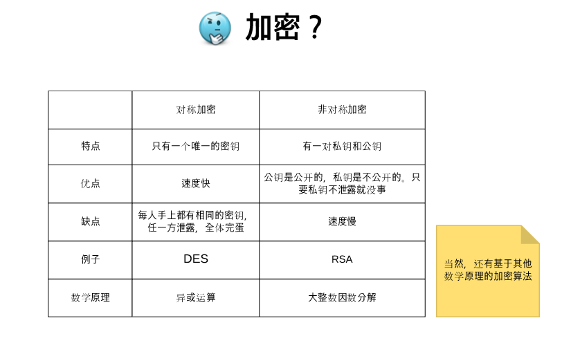
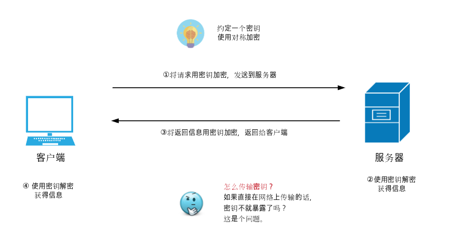

### CDN（content-delivery-network）系统有哪些组成部分
1. 基于缓存设备
    a. 把缓存在本地的内容快速的提供给用户
    b. 源站点进行准实时的内容同步（可以是源站点的主动推送，也可以是手动刷CDN）
2. 负载均衡系统
    a. 全局负载均衡
        根据就近原则，给用户分配最佳的服务节点
    b. 本地负载均衡
        节点内部设备集群的负债均衡
3. 运营管理系统
    支持服务于整个网络平台

### 在何种业务场景的项目中需要使用到 CDN， CDN 的工作方式和项目的关系

### 简单说说 CDN 的流程
CDN 主要做的事情：
1. 性能
2. 安全
第一步： DNS 域名解析过程
www.mytest.com => 浏览器缓存 => 操作系统缓存（host文件）=> 路由器缓存 => ISP的DNS服务器 => 根域名服务器

第二步：CDN
浏览器通过DNS解析域名获取到对应的IP地址
1. 用户没有使用CDN服务
    浏览器会根据IP地址向域名服务器发起请求，然后服务器返回数据 => 直连
2. 用户使用了CDN服务
    DNS解析 => CDN专用的DNS服务器 => CDN的全局负载均衡设备的IP地址返回给用户
    用户向CDN全局负载均衡设备发出请求，发出请求后，全局负载均衡设备会找到用户所属区域内的负载均衡设备，然后选择合适的空闲的服务器进行提供服务

### HTTP2
- 二进制分帧
    将数据包分成很多个二进制帧，以流的形式进行传输（可以乱序传输）
- 多路复用
    同一个域名下面只建立一个 TCP 连接，从而优化了 1.1 多个 TCP 连接慢启动造成的效率低下的问题。同时，摒弃了 1.1 的半双工，使用了全双工
- 头部压缩 [HPack](http://kapsterio.github.io/test/2021/07/29/hpack-explained.html)
    使用 http2 后，不需要再使用雪碧图、css 压缩合并等等，之前这么处理是针对 1.1 做的优化。但是 2.0 不需要了，而且多的请求可以优化动态表，从而更利于头部压缩
=> http2 只是解决了 http（应用）层的队头阻塞问题，TCP 层的队头阻塞还是在的，这个是 TCP 打娘胎里就带的特性。所以 http3 摒弃了 TCP 转而使用了 UDP，因为 UDP 本身自带多路复用，而且没有队头阻塞的问题.
### HTTP3新特性
[说一下 HTTP/3 新特性，为什么选择使用 UDP 协议？ #100](https://github.com/sisterAn/blog/issues/100)
引入了QUIC协议，基于UDP
QUIC虽然是基于 UDP，但是在原本的基础上新增了很多功能，比如多路复用、0RTT、TLS加密、流量控制、有序交付等等
#### 1. **多路复用、解决队头阻塞问题**
QUIC基于 UDP，而 UDP 本身就支持多路复用，多个数据流之间互不影响，所以也就不会存在队头阻塞的问题

#### 2. 更好的移动端表现
QUIC 在移动端的表现会比 TCP 好。因为 TCP 是基于 IP 和端口去识别连接的，这种方式在多变的移动端网络环境下是很脆弱的，一旦网络连接发生改变，就需要重新建联。但是 QUIC 是通过 ID 的方式去识别一个连接，不管你网络环境如何变化，只要 ID 不变，就能迅速重连上。
#### 3. **向前纠错机制**
每个包在包含其自身的内容之外，还包括了部分其他数据包的数据，因此在少量丢包的情况下可以通过其他包的冗余数据直接组装而无需重传。但是如果丢失了很多包还是需要重传的。
#### 4. 0RTT
> RTT 往返时间
首次是 1RTT，非首次是 0RTT
##### 初始握手

====step one====
1. 客户端发送一个 CHLO 请求（也就是打招呼的请求）
2. 服务端会返回一个 REJ 请求（拒绝请求），同时一并将服务端的证书以及长期公钥返回给客户端
3. 客户端对证书进行验证，然后将服务端的长期公钥缓存到本地
====step two====
1. 客户端生成一个短期秘钥，然后通过服务端公钥进行加密，发送给服务端（complete CHLO）
2. 客户端会在发送 complete CHLO 同时发送一个真实数据请求，使用客户端短期生成的秘钥进行加密，然后发送给服务端
3. 服务端接收到 complete CHLO 请求后，会使用自己的私钥进行解密得到客户端的短期秘钥
4. 服务端利用获取到的短期秘钥解密客户端发送过来的真实请求的信息
5. 服务端用短期秘钥加密返回信息，然后发送给客户端
=====> 综上，第一次建立连接的时候只花费了 1RTT
##### 重新建连

1. 客户端从本地缓存中取出服务器的长期公钥，同时创建一个短期秘钥，然后用长期公钥加密短期秘钥，发送 complete CHLO 请求
2. 与此同时，客户端用短期密钥加密发送真实请求
3. 服务端接收到 complete CHLO 请求后，获取到客户端的短期密钥，然后利用短期密钥解密真实请求
======> 这样，就达到了 0RTT 的数据传输

### HTTP3 的弊端
1. 很多企业、运营商和组织对于 53 端口（DNS）以外的UDP流量会进行拦截或者限流，因为这种流量可以用于攻击
2. 很多中间设备对于它的支持和优化程度并不高，所以出现丢包的可能性还是比较高的

### HTTP2 和 HTTP3 的对照区别
特性	        HTTP/2	        HTTP/3
传输层协议	      TCP	        基于UDP的QUIC
默认加密	      否	            是
独立的数据流	   否	             是
队头阻塞	   存在TCP队头阻塞	      无
报头压缩	     HPACK	           QPACK
握手时延	 TCP+TLS 的 1-3     RTT	0-1 RTT
连接迁移	      无	            有
服务器推送	       有	            有
多路复用	      有	            有
流量控制	      有	            有
数据重传	      有	            有
拥塞控制	      有	            有

### 4xx状态码
400 客户端错误
401 没登录，没权限
403 登录了，没权限
404 not found
405 请求的 method 不支持

### TCP 和 UDP 最大的区别是什么
- TCP 是面向连接的
- UDP 是无连接的
 TCP协议和UDP协议各有所长、各有所短，适用于不同要求的通信环境
 

### 1.1 2.0 3.0 版本
- 1.1
1. 长连接
2. 管道 - 假的并发，服务端还是要一个一个的响应
3. 浏览器优化（chrome） - 同一个域名同时支持6个 tcp 连接，从而实现并发
4. 缓存管理 - 强缓存、协商缓存

- 2.0
1. 二进制分帧
2. 多路复用 - 乱序传输，解决了应用层的队头阻塞
3. 只使用一个 tcp 连接进行数据传输，从而优化了 tcp 慢启动
4. 头部压缩 HPack
5. 服务端推送 - 静态资源的推送

- 3.0
1. 基于 UDP，天生就支持多路复用，同时解决了 tcp 的队头阻塞
2. 向前纠错 - 会携带其他数据包一些冗余的信息，如果在少量的丢包的情况下可以无需重传
3. 更好的移动端表现
4. 0RTT

### 三次握手🤝
- 三次握手
保证 client 和 server **互相知道**对方的发送能力和接受能力是 ok 的最小次数
client                      server  
  | --------你好，我是A-------> |                
  | <----收到你的信息了，我是B--- |
  | --收到你的信息了，我们连接了-> |
第一次请求：客户端发送一个连接请求
第二次请求：client 知道了 server 是发送和接受能力是 OK 的了，但此时服务端只知道 client 的发送能力是 OK 的
第三次请求：server 知道了 client 的接受能力也是 OK 的了，TCP 连接建立

### 为什么要引入https
1. 数据的保密性
2. 数据的安全性
3. 数据的完整性
总的来说：因为http是明文传输的，那在从客户端到服务端整个传输链路中的任何一个环节都有可能被劫持，然后进行窃取、伪造、篡改。这就是所谓的*中间人攻击*

https是在 `http层` 和 `tcp层` 中间加入了 `安全层(SSL/TLS)`

安全层的主要职责：
1. 对发起的 http 请求的数据进行加密
2. 对接收到的 http 的内容进行解密

### https 使用了非对称和对称加密混合加密的方法了，为什么还需要 CA证书
如果没有数字证书，客户端是无法确认当前收到的公钥是不是服务端的，也就是说，依然会存在中间人攻击，中间人只需要劫持客户端和服务的请求，然后把公钥替换成自己的，那就可以在中间为所欲为

CA证书的出现是为了证明`我是我`
客户端在与服务端建立安全连接的时候，服务端会发送给客户端一个数字证书，证书中包含了公钥和数字签名。（中间会有验证公钥的环节）客户端收到后会用摘要算法去对数字证书的内容进行计算，从而得到信息摘要A，然后用公钥解密出数字签名的内容，得到信息摘要B，如果 A 和 b一致，则确认证书合法的

### Charles 如何捕获 https 请求的
> [图解 HTTPS：Charles 捕获 HTTPS 的原理 #108](https://github.com/youngwind/blog/issues/108)
[HTTPS：让数据传输更安全](https://time.geekbang.org/column/article/156181)

- 不安全的 Http
1. 明文传输，属于裸奔
2. 内容被篡改
3. 身份被冒充

- 加密
使用 对称/非对称 结合的加密方式

依旧存在的问题是 - 中间人依旧可以劫持请求
通过对称和非对称混合方式，我们完美地实现了数据的加密传输。不过这种方式依然存在着问题，比如我要打开极客时间的官网，
但是黑客通过 DNS 劫持将极客时间官网的 IP 地址替换成了黑客的 IP 地址，这样我访问的其实是黑客的服务器了，
黑客就可以在自己的服务器上实现公钥和私钥，而对浏览器来说，它完全不知道现在访问的是个黑客的站

- 数字证书 - 证明我是我
这里我们结合实际生活中的一个例子，比如你要买房子，首先你需要给房管局提交你买房的材料，
包括银行流水、银行证明、身份证等，然后房管局工作人员在验证无误后，会发给你一本盖了章的房产证，
房产证上包含了你的名字、身份证号、房产地址、实际面积、公摊面积等信息。在这个例子中，你之所以能证明房子是你自己的，
是因为引进了房管局这个权威机构，并通过这个权威机构给你颁发一个证书：房产证。

