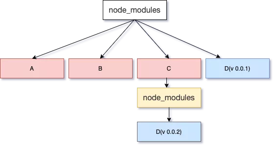
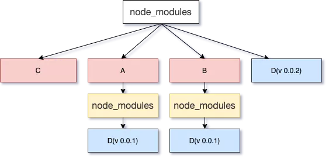

### 为什么项目中可以做直接执行 npm start
- npm start 是 npm 的内置的一个命令，只是巧合，并不是 npm run start 可以简写 npm start
- 如果 package.json 的 scripts 中没有定义 start 命令，那会默认执行 `node service.js`

### 使用 creat-react-app 创建 react 项目的时候，为什么前面要加 npx
npx 是 npm 从 v5.2.0 开始新增的命令
npx 可以快捷的运行包中的命令或者可执行的代码
```js
// 比如某个项目中安装了 webpack，但是全局没有安装，我们可以通过两种方式去执行webpack
// 一种是通过package.json 中的 scripts 去执行
// 一种就是通过 npx 直接在命令行中执行
// npx webpack
```
当执行 *$ npx <command>* 的时候， npx 会先在本地查找
* 找到了，就用本地版本去执行
* 没找到，直接下载最新版本放到临时缓存中，执行命令
* 执行完成后，就会清除相关命令，不会在本机或者项目中留下任何东西
* 好处是，这样不会污染本地，同时可以永远使用最新版本的 dependency

### npm 安装机制
npm 3 之前，所有的包依赖都是树状的，嵌套在一起
-  造成了很多的冗余，而且很复杂

npm 3 做了优化
- 拍平
npm 3 会遍历所有的节点，逐个将模块放在 node_modules 的第一层，当发现重复的模块时
* 同版本，则丢弃
* 不同版本，也就是版本不兼容，则继续采用 npm2 的处理方式，前面的放在 node_modules 的第一层，后面的放在依赖树中（会有先后顺序，也就是说，先到先得），所以不同的安装顺序可能会导致不同的 node_modules 结构

例子：
现在有 A、B、C 三个包，他们都依赖于 D，而A、B 是依赖于 D@1.1，C 依赖于 D@1.2
1. 如果先安装 A 和 B

2. 如果先安装 C

