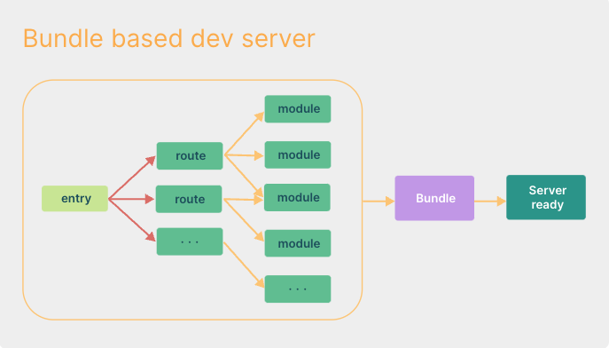
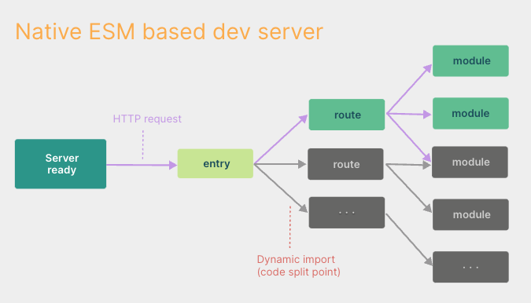

### vite
依赖会进行预编译，然后缓存在node_moudles/.vite目录下，使用强缓存，如果package.json/lock文件/vite的配置文件三者其一发生变化，才会去检查依赖包，如果需要才会重新预编译依赖包
项目文件会根据页面路由请求相应的module，然后拦截请求去进行编译，然后返回给浏览器

依赖和项目组件在请求上怎么区分，请求路劲中带modules是依赖项，而项目组件则是组件的路劲

其中vite对于vue的支持是最高的。它会将vue的一个文件拆分成三个请求
style、script、template，如果只是style发生变化，那它只会重新构建style然后通过HMR去更新

### webpack 和 vite
开发环境下的对比：
1. webpack 是需要先将项目打包成bundle文件，然后才能起 本地服务，最后是浏览器请求打包后的资源

2. vite 不需要先打包，直接起本地服务，浏览器直接请求所需模块 => 将所需模块实时打包编译

### webpack 如何提升打包编译速度
