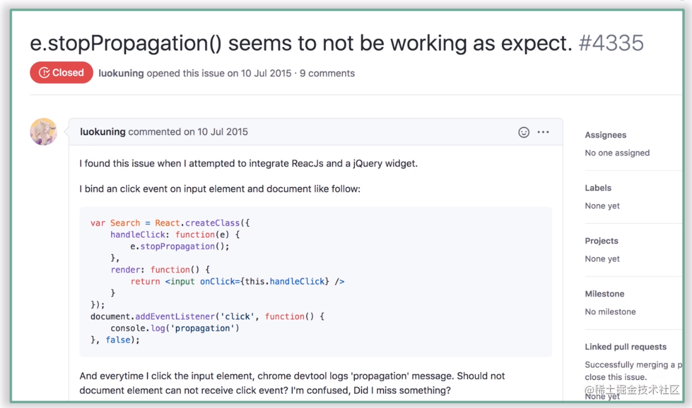

### MVC 和 MVVM 区别
1. MVC - model view controller
数据（model）发生变化 => controller 处理和操作 dom => view 更新视图
类似于原生/JQuery 的模式，这种模式会导致我们需要关注更新 dom 的细节，随着项目的增大，controller会变的异常臃肿，而且难以维护
2. MVVM - Model view viewModel 
数据 通过 viewModel 更新到页面上
view 的变动通过 viewModel 更新到 model 层
上面的过程我们不需要关注更新 dom 的细节，只需要关注 数据的变化以及页面的操作即可
### JSX
- jsx是js的语法拓展（语法糖）
- 类似于模版语言
- 支持在JS 中像写原生 HTML 一样去写模版
- 最后通过 React.createElement 转为 ReactElement 也就是 VDOM
- 总的来说，jsx 其实就是 js， 只是支持了 一些模版的语法，类似于 ejs，但是最后编译后还是纯 JS

### React16为什么要改造生命周期
主要是为了配合Fiber架构带来的**异步渲染**机制

#### getDerivedStateFromProps
getDerivedStateFromProps是一个静态方法，不依赖组件实例而存在，因此在这个方法内部是访问不到this
getDerivedStateFromProps不是componentWillMout的替代品，因为不值得也不配。
getDerivedStateFromProps是用来替换componentWillReceiveProps，*为了让props的处理过程更纯粹*
getDerivedStateFromProps有且只有一个用途：*使用props去派生/更新state*

#### getSnapshotBeforeUpdate
执行时机：render方法之后，真实dom更新之前
📌定位：getSnapshotBeforeUpdate生命周期设计的初衷是为了搭配componentDidUpdate一起，覆盖过时的componentWillUpdate（为啥它肥死不可，因为它挡了fiber的路，挡路者死）
使用场景： 获取更新前的DOM信息，比如滚动信息，用来做一些页面滚动处理
可以同时获取到更新前的DOM和更新前后的state和props
getSnapshotBeforeUpdate的返回值作为componentDidUpdate方法第三个参数传入

### 数据管理
#### context API
老版本：
1.代码不够优雅
2.无法保证数据的生产者和消费者之间的及时同步
新版本：
1.优化了这一点，保证了生产者和消费者之间的数据一致性
#### Redux
> Redux是一个状态容器
> Redux 发布订阅的实现方式，以store为数据中心，使用 dispatch 触发从而修改数据，使用 subscribe 订阅数据。dispatch 的时候会通知所有的 subscribe 函数


1.`什么是状态容器`-存放公共数据的仓库
例子：假如把项目中的所有组件拉到一个钉钉群里，那Redux充当了这个群里的`群文件`这个角色
2.*在整个Redux的工作流程中，数据流向是严格单向的*

### React-Hooks
理解Hooks之前先看一下类组件和函数组件
#### 类组件
> 就像一个重装战舰一样，很强大，但是上手门槛也很高，需要清楚的了解怎么去操作这个超级战舰

通过继承React.Component创建，继承Component的state和生命周期等，大而全，我继承后就拥有了很多能力，代价就是学习成本，而且逻辑是和生命周期粘合在一起的，很难抽离和复用逻辑

#### 函数组件
> 轻巧快艇

没有state和生命周期这么重的东西，学习成本很低

#### 两者最大的不同点：
[dan分享的相关文章](https://overreacted.io/zh-hans/how-are-function-components-different-from-classes/)
`Function Components capture the rendered values`
函数式组件捕获了渲染所需的数据

#### hooks
> 一套强大的工具箱，重装战舰那些预制的能力这个工具箱里几乎都有，开发者可以灵活的选择用哪些能力，而不是全部都装上

#### 为什么会引入React-Hooks
1. 让函数组件也能够做类组件的事，可以处理一些副作用，能拿 ref
2. 告别难以理解的Class，主要是this和生命周期
3. 相关的业务逻辑在类组件里是分散在各个生命周期中，而一个生命周期中却糅杂着各种不相关的逻辑，逻辑和生命周期耦合在一起
    类组件中，我们更多的是面向生命周期去编写逻辑代码，和React理念相悖，应该关注的是数据的变化，当某个数据发声变化要做什么，就像之前那个很经典的公式UI = render(data);
4. 使状态逻辑复用变得简单,过去复用逻辑更多的是靠HOC或者Render Props，他们在实现逻辑复用的同时也破坏者组件结构，最常 见的就是嵌套地狱
5. 函数组件从设计思想角度来看更加契合React理念

#### 理性看待Hooks
1. Hooks暂时还没有补齐类组件的能力，比如getSnapshotBeforeUpdate、componentDidCatch,这些生命周期还是强依赖类组件

#### React Hooks 是如何模拟生命周期的
```js
import { useEffect } from 'react';

useEffect(() => {
    console.log('mock:componentDidMount');
    return () => {
        console.log('mock:componentWillUnmount');
    }
}, []);

useEffect(() => {
    console.log('mock:componentDidUpdate');
});

useEffect(() => {
    console.log('mock:componentWillReceiveProps');
}, [props]);
```

### VDOM
#### React选用VDOM是为了更好的性能吗
在整个DOM操作的演化过程中，主要矛盾并不在于性能，而在于开发者是否能有较好的研发体验和研发效率
**虚拟DOM优越之处在于，它能提供更便捷、高效的研发模式的同时，还能够保持较为稳定的性能表现**

#### 真正价值
1. 研发体验、研发效率
2. 跨平台的问题
3. 差量更新和批量更新


### Diff
react 的diff基于currentIndex 和lastIndex 进行同层比较，从新的 VDOM 的第一个节点开始，去寻找上升子序列（📢：这里找的并不是最长的上升子序列，只是从第 0 项开始找，也就是从第 0 个开始和 older VDOM 去对比，找到不相交的线，也就是最长公共子序列），因为最长的上升子序列不一定是从 0 开始的

vue3.x 的diff是找的最长上升子序列
#### 15版本
1. 大部分情况下，相同类型的组件其DOM结构也相同
* 如果类型相同则进一步对比，如果不同，则删除替换等操作
2. 对比是在相同层级上进行的对比，因为大部分情况下，很少会做DOM结构的跨层级操作，而且这种跨层级操作的开销比较大，React官方也不建议这么做。项目中应尽可能保证DOM结构的稳定性
3. key可以在同层对比的时候可以复用节点

#### 16版本
？？？？

### Fiber
核心：可中断、可恢复、优先级


### ReactDOM.render和ReactDOM.createRoot
ReactDOM.render：同步执行，一气呵成
ReactDOM.createRoot：异步执行（看情况的，也有可能是同步执行）
区别是fiber上面的mode，在scheduleUpdateOnFiber中会去判断，如果是同步，则调用performSyncWorkOnRoot，否则走异步

### 事件系统
16 和 18 区别
#### 16
1. 是在completeWork阶段去收集和挂载的

2. 合成事件对象会被放进一个叫做“事件池”的地方统一管理，这样做的目的是能够实现事件对象的复用，从而提高性能。
```javascript
    function handleChange(e) {
        // this won't work because the event object gets reused.
        setTimeout(() => {
            // 这个地方就会报错，因为事件对象已经回收
            console.log(e.target.value); // too late
        });
    }
```
3. 按需绑定，如果在completeWork阶段进行各个节点的props上面的事件收集的时候，如果当前事件已经监听了，那直接把cbpush进队列里就好了，没有则在document上绑定监听

4. 执行时机：是在原生的捕获和冒泡之后才执行合成事件的捕获和冒泡

#### 18
1. 是在初始化的时候，也就是创建完fiberRoot和rootFiber之后就绑定事件监听，全量监听

2. 去除了事件池，如果事件触发了，会去判断当前触发的事件有没有对应的listeners，如果没有则跳过

3. 执行时机： 执行原生事件的捕获 => 合成事件的捕获 => 原生事件的冒泡 => 合成事件的冒泡。注意：这里面并不是执行完所有的原生捕获事件以后才执行合成捕获事件，而且从根节点开始向下捕获的时候，会检查每个节点是否有原生捕获事件，如果有就先执行原生捕获事件，如果没有就检查该节点有没有合成捕获事件，如果有就执行

4. 整个过程是交替执行的，只是每个DOM节点先检查原生事件，然后再检查合成事件

#### 总结
因为16的合成事件执行时机，导致了如果我去阻止冒泡是阻止不了原生事件的冒泡事件的
下面是相应的解释：



### react18取消了Effect list，取而代之的是遍历整个fiber树
- 在18版本之前，beginWork阶段是自顶向下深度优先遍历的，然后如果遇到叶子节点就会触发当前节点的completeWork，那completeWork自下向上回到跟节点，那既然回都回去了，不如把effect收集一下，从而让commit阶段坐享其成，直接拿completeWork阶段的成果用。然后就有了completeWork的EffectList

- 但是在 React18 中取消了这个effectList数据结构，取而代之的是在 commit 阶段遍历整个fiber树，subtreeFlags辅助提升性能（每个需要更新的节点都会打上 flag，然后向上反馈到父节点上，如果父节点的subtreeFlags === NoFlags 那就不用向下继续遍历了）

### redux
1. 为什么需要redux
前端复杂性很大程度上是由于大量的无序的操作导致的。
比如一个复杂的项目中可能存在父子、子父、兄弟、跨层级或者是反向数据流等，整个项目的数据处理会变得异常复杂且难以追踪数据的变化。
===> redux的目标是：1.让state的变得可预测；2.统一管理动作和状态

2. applymiddleware源码中有执行每个middleware然后传入middleWareAPI，其中dispatch为什么用一个匿名函数包裹
因为要保证被派发到每个中间件的中的dispatch都是同一个且是最新的

### React18中的Automatic batching
[](https://github.com/reactwg/react-18/discussions/21)

### 为什么useState使用数组而不是对象
- 解构赋值的问题：
数组依次排序的，所以可以随便命名
对象不行，而且要对应上

### react Hooks为什么不能写在循环或者if语句中
那么 React 怎么知道哪个 state 对应哪个 `useState`？
答案是 React 靠的是 Hook 调用的顺序。
只要 Hook 的调用顺序在多次渲染之间保持一致，React 就能正确地将内部 state 和对应的 Hook 进行关联。
[Hook 规则](https://zh-hans.reactjs.org/docs/hooks-rules.html)

### useEffect 和 useLayoutEffect 区别
- 执行时机不同
- useEffect 是异步的
- useLayoutEffect 是同步的

### useInsertionEffect
useInsertionEffect 执行在 dom 更新之前，所以此时可以做一些dom处理，比如 CSS-IN-JS，从而减少不必要的重绘和重排

### 为什么不建议用 index 作为 key
1. 如果破坏了 index 顺序会造成不必要的渲染，比如逆序添加
2. 数据错位
[参考](https://www.cnblogs.com/yingzi1028/p/16647253.html)

### React 对于异步（低优先级的任务）调度（模拟实现的 requestIdleCallbck）
- requestHostCallback => schedulePerformWorkUntilDeadline
- 如果是浏览器模式下，使用 MessageChannel 发布订阅的模式去调度
- 如果是非浏览器模式下，使用 setTimeout 去调度
=> 当然，官方也在代码里注释
```js
// We prefer MessageChannel because of the 4ms setTimeout clamping.
```

### useTransition 的作用
- useTransition is a React Hook that lets you update the state without blocking the UI.
- 用法：
```js
function TabContainer() {
  const [isPending, startTransition] = useTransition();
  const [tab, setTab] = useState('about');

  function selectTab(nextTab) {
    startTransition(() => {
      setTab(nextTab);
    });
  }
  // ...
}
```
- 说白了，就是我通过 starTransition 包裹的 callback 会进行异步调度。
- 例子：比如说页面上有一个 Input 框，然后在 Input 中输入内容的同时要做两件事：
    1. 需要将输入的内筒回显到Input框中（受控组件）
    2. 将输入的内容绘制成一千行列表
```js
function Page() {
    const [val, setVal] = useState('');
    const [list, setList] = useState([]);

    const handleChange = (e) => {
        const curVal = e.target.value;
        setVal(curVal);

        const curArr = [];
        for(let i = 0; i < 1000; i++) {
            curArr.push(`${i}-${curVal}`);
        }
        setList(curArr);
    }

    return (
        <div>
            <Input onChange={handleChange} value={val} /> 
        </div>
    )
}
```
- 按照上面这么写，input在输入的时候肯定会有卡顿的感觉，因为每次change的时候都要渲染 list，setVal(curVal) 和 setList(curArr) 的优先级是一样的
- 但是，setList(curArr) 的优先级明显是低于 setVal(curVal)
- 这个时候就用到了 useTransition，手动将 某些任务降低优先级
```js
function Page() {
    const [val, setVal] = useState('');
    const [list, setList] = useState([]);
    const [isPending, startTransition] = useTransition();

    const handleChange = (e) => {
        const curVal = e.target.value;
        setVal(curVal);

        startTransition(() => {
            const curArr = [];
            for(let i = 0; i < 1000; i++) {
                curArr.push(`${i}-${curVal}`);
            }
            setList(curArr);
        });
    }

    return (
        <div>
            <Input onChange={handleChange} value={val} /> 
        </div>
    )
}
```