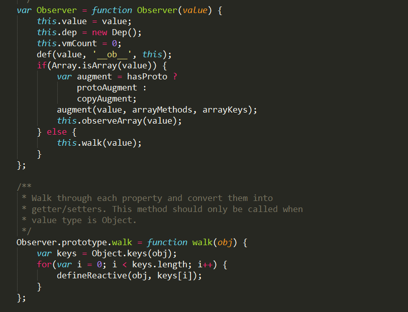

### vue3.x 为什么使用 Proxy 代替了 Object.defineProperty
- 直接使用尤大大的原话： 因为性能问题

Object.defineProperty 是可以检测数组值的变化的
```js
var a = [1, 2, 3];

for(let i = 0; i < a.length; i++) {
    Object.defineProperty(arr,index,{
       set:function(val){
           console.log('set')
           item = val
       },
       get:function(val){
           console.log('get')
           return item
       }
    });
}
```
例如上面👆🏻这样，给数组中每一个元素都加上监听，但是 vue 源码中是判断如果当前数据是数组，那么就忽略掉其内部值，也就是说，如果是数组，那内部的值是不会去添加 Object.defineProperty 的

可以看到，当数据是数组时，会停止对数据属性的监测

其实从技术能力上是可以实现数组内部数据的响应式的，但是从性能上来看，`性能的代价和获得的用户体验收益是不成正比的`，所以这也是为什么 vue 会这么处理

### nextTick 原理
- 作用：
nextTick 接收一个 callback 作为参数，并将这个 callback 延迟到 DOM 更新后才执行.
- 原理：
将传入的 callback 包装成异步任务，优先微任务，如果都不支持，只能通过 setTimeout 实现
- 细节：
源码中判断了不同环境支持的方法，提供了四种方式去创建异步任务：
1. Promise.then
2. MutationObserver
3. setImmediate - 这个只用 IE 10/11 和 node 环境支持
4. setTimeout

### new Vue 都做了什么
1. 合并配置
2. 初始化生命周期
3. 初始化 data、props、computed、watch 等
4. 初始化事件中心