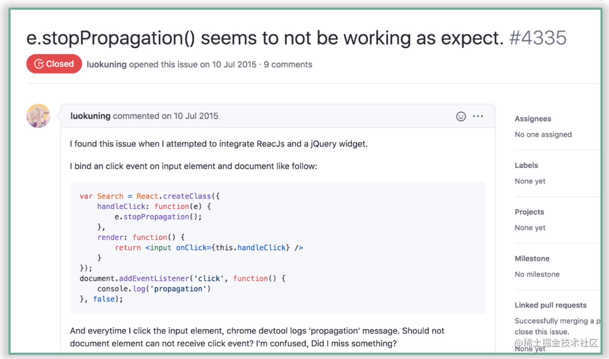

### MVC 和 MVVM 区别
1. MVC - model view controller
数据（model）发生变化 => controller 处理和操作 dom => view 更新视图
类似于原生/JQuery 的模式，这种模式会导致我们需要关注更新 dom 的细节，随着项目的增大，controller会变的异常臃肿，而且难以维护
2. MVVM - Model view viewModel 
数据 通过 viewModel 更新到页面上
view 的变动通过 viewModel 更新到 model 层
上面的过程我们不需要关注更新 dom 的细节，只需要关注 数据的变化以及页面的操作即可
### JSX
jsx是js的语法拓展（语法糖）

### React16为什么要改造生命周期
主要是为了配合Fiber架构带来的**异步渲染**机制

#### getDerivedStateFromProps
getDerivedStateFromProps是一个静态方法，不依赖组件实例而存在，因此在这个方法内部是访问不到this
getDerivedStateFromProps不是componentWillMout的替代品，因为不值得也不配。
getDerivedStateFromProps是用来替换componentWillReceiveProps，*为了让props的处理过程更纯粹*
getDerivedStateFromProps有且只有一个用途：*使用props去派生/更新state*

#### getSnapshotBeforeUpdate
执行时机：render方法之后，真实dom更新之前
📌定位：getSnapshotBeforeUpdate生命周期设计的初衷是为了搭配componentDidUpdate一起，覆盖过时的componentWillUpdate（为啥它肥死不可，因为它挡了fiber的路，挡路者死）
使用场景： 获取更新前的DOM信息，比如滚动信息，用来做一些页面滚动处理
可以同时获取到更新前的DOM和更新前后的state和props
getSnapshotBeforeUpdate的返回值作为componentDidUpdate方法第三个参数传入

### 数据管理
#### context API
老版本：
1.代码不够优雅
2.无法保证数据的生产者和消费者之间的及时同步
新版本：
1.优化了这一点，保证了生产者和消费者之间的数据一致性
#### Redux
> Redux是一个状态容器

1.`什么是状态容器`-存放公共数据的仓库
例子：假如把项目中的所有组件拉到一个钉钉群里，那Redux充当了这个群里的`群文件`这个角色
2.*在整个Redux的工作流程中，数据流向是严格单向的*

### React-Hooks
理解Hooks之前先看一下类组件和函数组件
#### 类组件
> 就像一个重装战舰一样，很强大，但是上手门槛也很高，需要清楚的了解怎么去操作这个超级战舰

通过继承React.Component创建，继承Component的state和生命周期等，大而全，我继承后就拥有了很多能力，代价就是学习成本，而且逻辑是和生命周期粘合在一起的，很难抽离和复用逻辑

#### 函数组件
> 轻巧快艇

没有state和生命周期这么重的东西，学习成本很低

#### 两者最大的不同点：
[dan分享的相关文章](https://overreacted.io/zh-hans/how-are-function-components-different-from-classes/)
`Function Components capture the rendered values`
函数式组件捕获了渲染所需的数据

#### hooks
> 一套强大的工具箱，重装战舰那些预制的能力这个工具箱里几乎都有，开发者可以灵活的选择用哪些能力，而不是全部都装上

#### 为什么会引入React-Hooks
1. 告别难以理解的Class，主要是this和生命周期
2. 相关的业务逻辑在类组件里是分散在各个生命周期中，而一个生命周期中却糅杂着各种不相关的逻辑，逻辑和生命周期耦合在一起
    类组件中，我们更多的是面向生命周期去编写逻辑代码，和React理念相悖，应该关注的是数据的变化，当某个数据发声变化要做什么，就像之前那个很经典的公式UI = render(data);
3. 使状态逻辑复用变得简单,过去复用逻辑更多的是靠HOC或者Render Props，他们在实现逻辑复用的同时也破坏者组件结构，最常 见的就是嵌套地狱
4. 函数组件从设计思想角度来看更加契合React理念

#### 理性看待Hooks
1. Hooks暂时还没有补齐类组件的能力，比如getSnapshotBeforeUpdate、componentDidCatch,这些生命周期还是强依赖类组件

### VDOM
#### React选用VDOM是为了更好的性能吗
在整个DOM操作的演化过程中，主要矛盾并不在于性能，而在于开发者是否能有较好的研发体验和研发效率
**虚拟DOM优越之处在于，它能提供更便捷、高效的研发模式的同时，还能够保持较为稳定的性能表现**

#### 真正价值
1. 研发体验、研发效率
2. 跨平台的问题
3. 差量更新和批量更新


### Diff
#### 15版本
1. 大部分情况下，相同类型的组件其DOM结构也相同
* 如果类型相同则进一步对比，如果不同，则删除替换等操作
2. 对比是在相同层级上进行的对比，因为大部分情况下，很少会做DOM结构的跨层级操作，而且这种跨层级操作的开销比较大，React官方也不建议这么做。项目中应尽可能保证DOM结构的稳定性
3. key可以在同层对比的时候可以复用节点

#### 16版本
？？？？

### Fiber
核心：可中断、可恢复、优先级


### ReactDOM.render和ReactDOM.createRoot
ReactDOM.render：同步执行，一气呵成
ReactDOM.createRoot：异步执行（看情况的，也有可能是同步执行）
区别是fiber上面的mode，在scheduleUpdateOnFiber中会去判断，如果是同步，则调用performSyncWorkOnRoot，否则走异步

### 事件系统
16 和 18 区别
#### 16
1. 是在completeWork阶段去收集和挂载的
2. 合成事件对象会被放进一个叫做“事件池”的地方统一管理，这样做的目的是能够实现事件对象的复用，从而提高性能。
```javascript
    function handleChange(e) {
        // this won't work because the event object gets reused.
        setTimeout(() => {
            // 这个地方就会报错，因为事件对象已经回收
            console.log(e.target.value); // too late
        });
    }
```
3. 按需绑定，如果在completeWork阶段进行各个节点的props上面的事件收集的时候，如果当前事件已经监听了，那直接把cbpush进队列里就好了，没有则在document上绑定监听

4. 执行时机：是在原生的捕获和冒泡之后才执行合成事件的捕获和冒泡

#### 18
1. 是在初始化的时候，也就是创建完fiberRoot和rootFiber之后就绑定事件监听，全量监听
2. 去除了事件池，如果事件触发了，会去判断当前触发的事件有没有对应的listeners，如果没有则跳过
3. 执行时机： 执行原生事件的捕获=> 合成事件的捕获 => 原生事件的冒泡 => 合成事件的冒泡

#### 总结
因为16的合成事件执行时机，导致了如果我去阻止冒泡是阻止不了原生事件的冒泡事件的
下面是相应的解释：



### react18取消了Effect list，取而代之的是遍历整个fiber树
在18版本之前，beginWork阶段是自顶向下深度优先遍历的，然后如果遇到叶子节点就会触发当前节点的completeWork，那completeWork自下向上回到跟节点，那既然回都回去了，不如把effect收集一下，从而让commit阶段坐享其成，直接拿completeWork阶段的成功用。然后就有了completeWork的EffectList
但是在React18中取消了这个effectList数据结构，取而代之的是遍历整个fiber树，subtreeFlags辅助提升性能

### redux
1. 为什么需要redux
前端复杂性很大程度上是由于大量的无序的操作导致的。
比如一个复杂的项目中可能存在父子、子父、兄弟、跨层级或者是反向数据流等，整个项目的数据处理会变得异常复杂且难以追踪数据的变化。
===> redux的目标是：1.让state的变得可预测；2.统一管理动作和状态

2. applymiddleware源码中有执行每个middleware然后传入middleWareAPI，其中dispatch为什么用一个匿名函数包裹
因为要保证被派发到每个中间件的中的dispatch都是同一个且是最新的

### React18中的Automatic batching
[](https://github.com/reactwg/react-18/discussions/21)


